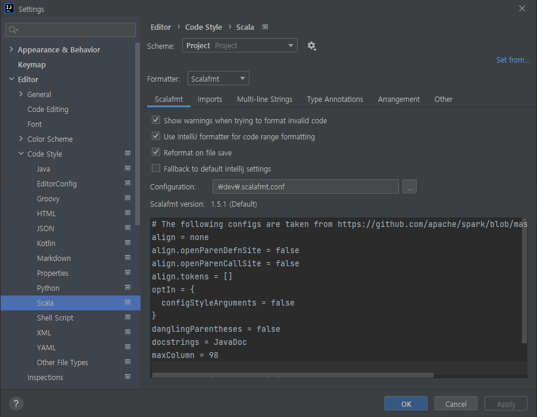

Scala Coding Style
===============

* For Scala code, we strictly follow these coding and style guidelines:
    * [Databricks Scala Guide](https://github.com/databricks/scala-style-guide)
    * [Scala style guide](https://docs.scala-lang.org/style/)
    
> Note: Databricks Style Guide will be preferred for conflict resolutions.

* For formatting, [scalafmt](https://scalameta.org/scalafmt) is used with the custom configuration (found in [/dev/.scalafmt.conf](/dev/.scalafmt.conf))
  * Set scalafmt as the formatter
    * Open Preferences (Settings if you use Windows) > Editor > Code Style > Scala
    * Select Scalafmt as the formatter
    * Check 'Reformat on file save'
    * Select `./dev/.scalafmt.conf` for Configuration
    
  * Detailed installation of `scalafmt` can be found [here](https://scalameta.org/scalafmt/docs/installation.html)
  

* There is also a Scala style check using [scalastyle-config.xml](/scalastyle-config.xml), which is run automatically when you compile your project using `sbt`.
